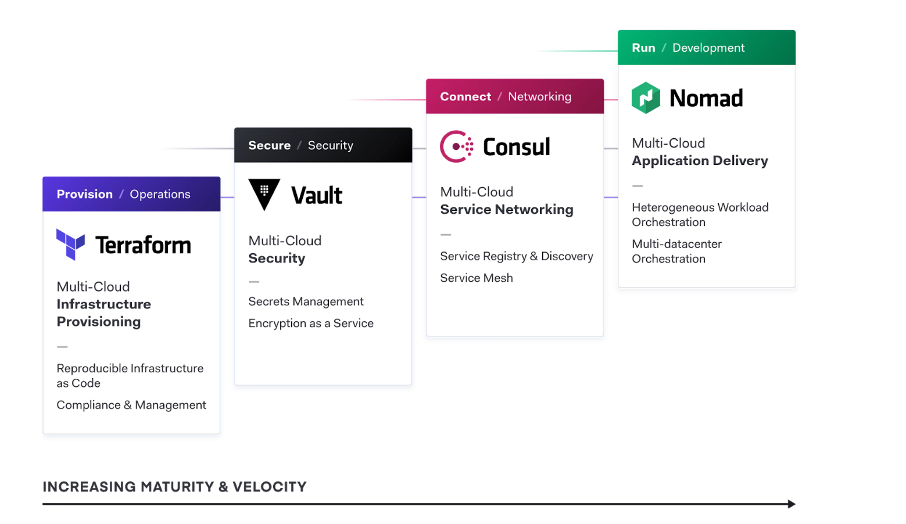
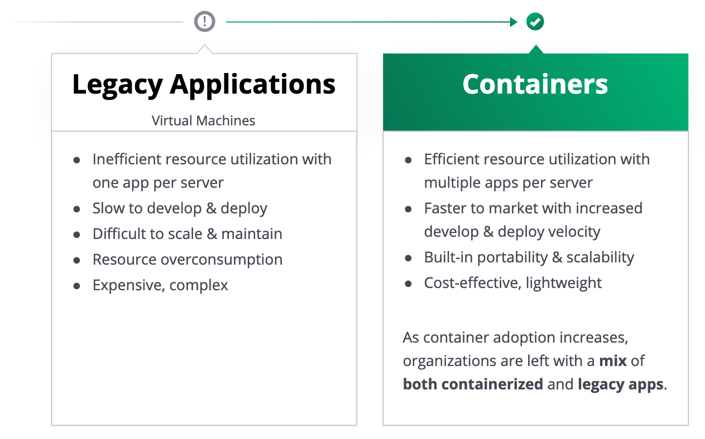
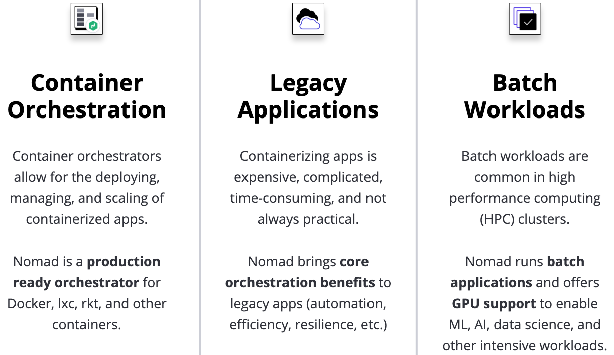
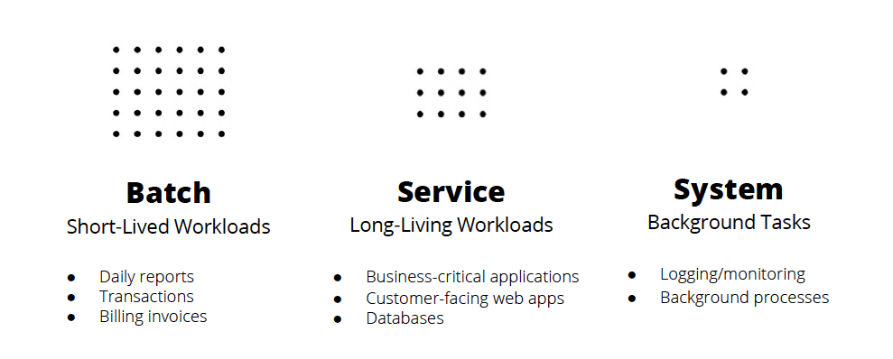
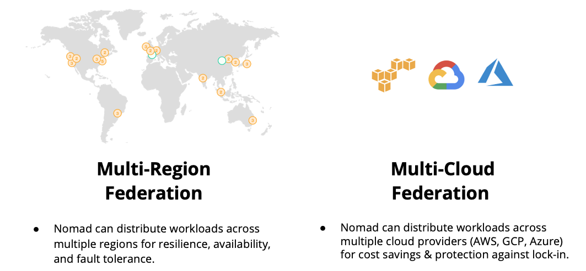

name: advanced-nomad-workshop-title-slide
class: title, shelf, no-footer, fullbleed
background-image: url(https://hashicorp.github.io/field-workshops-assets/assets/bkgs/HashiCorp-Title-bkg.jpeg)
count: false

# Advanced Nomad Workshop
## Flexible Workload Orchestration

???
* This workshop introduces students to advanced features of Nomad OSS and to Nomad Enterprise features.
* It is cloud agnostic.

---
layout: true

.footer[
- Copyright © 2020 HashiCorp
- 
]

---
name: Link-to-Slide-Deck
# The Slide Deck
  
### Follow along on your own computer at this link:

https://hashicorp.github.io/field-workshops-nomad/slides/multi-cloud/advanced-nomad/#1

???
* Here is a link to the slides so you can follow along, but please don't look ahead!

---
name: workshop-topics
# Workshop Topics
1. Nomad Overview
1. Nomad Advanced Job Placement and Variable Interpolation
1. Nomad Job Update Strategies
1. Nomad Federation and Multi-Region Deployments
1. Nomad Integration with Vault Using Templates
1. Nomad Security
1. The Nomad Autoscaler
1. Nomad Enterprise Platform Features
1. Nomad Governance and Policy Features
1. Nomad Stateful Workloads

???
The topics for the workshop

---
name: instruqt-tracks
class: compact
# Lab Environment Used
* This workshop uses [Instruqt](https://instruqt.com) for hands-on labs.
* Instruqt labs are run in "tracks" that are divided into "challenges".
* Here are some of the tracks you will use:
  * [Nomad Advanced Job Placement](https://play.instruqt.com/hashicorp/invite/rbexlxuhgqgd)
  * [Nomad Job Update Strategies](https://play.instruqt.com/hashicorp/invite/1a910sszvvpe)
  * [Nomad Multi-Region Federation](https://play.instruqt.com/hashicorp/invite/dgpya4wz0c2z)
  * [Nomad Integration with Vault](https://play.instruqt.com/hashicorp/invite/lf9lvmtfpson)
  * [Nomad Enterprise Governance](https://play.instruqt.com/hashicorp/invite/yvqyiphxoc0e)
* If you're fast, you'll also be able to run one of three stateful workload tracks.

???
* This workshop uses labs run in Instruqt

---
name: nomad-overview
class: title, shelf, no-footer, fullbleed
background-image: url(https://hashicorp.github.io/field-workshops-assets/assets/bkgs/HashiCorp-Title-bkg.jpeg)
count: false

# Nomad Overview

???
* We thought it would be a good idea to repeat the Nomad Overview from the Introduction to Nomad workshop.
---
name: chapter-intro-nomad-place-in-hashistack
# Nomad's Place in the HashiStack
.center[]

???

* Organizations can use Nomad to run their containerized workloads across any cloud or on premise.

---
name: chapter-intro-shift-to-containers
# The Shift to Containers
.center[]

???
*  Lowers total cost of ownership (TCO) via bin packing
*  Runs both containerized and legacy apps (e.g. Java classes and jars)
*  Easy to operate and maintain

???
* Companies are embracing containers, but still need to run legacy applications.
* Nomad supports both.

---
name: chapter-intro-nomad-business-value
# Nomad's Business Value
* Increase Hardware Utilization.
  * Increase density of running applications through bin-packing.
* Reduce Operational Overhead.
 * Empower developers to self-service their own applications with less or no assistance from operators.
* Accelerate Time To Market.
  * Run containers and legacy applications together with the same workflow on the same infrastructure.

???
*  Let's discuss the business benefits of Nomad.

---
name:  chapter1-what-is-nomad
# What is Nomad?
* A flexible, lightweight, high performing, easy to use orchestrator
* Used to deploy and manage containers and legacy applications simultaneously
* Works across data centers and cloud platforms, providing universal scheduling
* Manages services, batch functions, as well as global system services

???
* Nomad runs as a single binary in just about any environment * one of the easiest and lightweight service scheduler and manager available.
*  Used to deploy both container applications, as well as legacy applications such as Java or raw executables.
*  As an independent function, Nomad can run and communicate across data centers, and cloud platforms.  Truly cloud agnostic.
*  Can manage individual services, batch functions, or even global system services such as monitoring functions.

---
name: chapter-intro-nomad-use-cases
# Nomad Use Cases
.center[]

???
* Container Workloads
* Legacy Applications
* Batch Jobs like Machine Learning

---
name: chapter-intro-nomad-workload-types
# Run All Types of Workloads
.center[]

???
* Nomad can run these 3 types of workloads

---
name: chapter-intro-nomad-autoscaling
class: compact
# Nomad Autoscaling
* Nomad supports two types of autoscaling:
  * **Horizontal Application Autoscaling** allows the counts of task groups to dynamically scale up and back down.
  * **Horizontal Cluster Autoscaling** allows the size of a Nomad cluster to dynamically scale out and back in.
* The latter is currently only supported in AWS using Auto Scaling Groups (ASGs).
* Both types of autoscaling are driven by APM metrics.
* The Nomad Autoscaler agent can be deployed as a Nomad job.

???
* Nomad supports two types of autoscaling:
  * Horizontal application autoscaling
  * Horizontal cluster autoscaling
* The latter is currently only supported in AWS.
* Both reply upon APM metrics such as those from Prometheus.
* The Nomad Autoscaler agent can be deployed as a Nomad job.

---
name: chapter-intro-nomad-federation
# Federation Made Real
.center[]

???
* Nomad can deploy applications seamlessly to federated clusters across multiple clouds.
* It is the first and only orchestrator on the market with complete and fully-supported federation capabilities for production.
---
name: chapter-intro-nomad-oss-features
class: smaller
# Nomad Open Source Features
* Service/Batch Schedulers
* Flexible Task Drivers
* Device Plugins
* Multi-Update Strategies
* Multi-Region Federation
* Autoscaling
* Container Storage Interface Plugins
* Container Network Interface Plugins
* Access Control System
* Web UI
* Consul & Vault Integration

???
* Service and Batch Schedulers enable both short and long-lived workloads
* Task drivers like docker, podman, java, exec
* Device Plugins allow community members to extend Nomad functionality to other drivers and devices including NVIDIA GPUs for compute-intensive workloads
* Enables various update strategies such as rolling, blue-green and canary
* Nomad Clusters can be federated across multiple cloud regions and on-prem datacenters
* Autoscaling supports horizontal scaling of both applications (changing task group count) and of clusters (changing # of Nomad clients)
* Supports CSI and CNI plugins for maximum flexibility of storage and networking.
* ACLs to control access to data and APIs
* Web UI included out-of-the-box
* Native integration with other HashiCorp products Consul and Vault
*

---
name: chapter-intro-nomad-enterprise-platform-features
# Nomad Enterprise Platform Features
* All Open Source Features
* Automated Upgrades with Autopilot
* Automated Backups with Snapshot Agent
* Enhanced Read Scalability
* Redundancy Zones
* Multiple Vault Namespaces

???
* All Open Source Features are included in Enterprise
* Autopilot Upgrades
* Automated backups with Nomad's Snapshot agent
* Servers can act as a non-voting member of the cluster to help provide read scalability
* Nomad attempts to parition servers according to specified redundancy zone, and will aim to keep one voting server per zone
* A single Nomad cluster can access multiple namespaces of a Vault cluster.

---
name: chapter-intro-nomad-enterprise-modules
class: compact
# Nomad Enterprise Modules
* Nomad Enterprise Governance & Policy Module
  * Namespaces
  * Resource Quotas
  * Sentinel Policies
  * Cross-Namespace Queries
  * Audit Logging
* Nomad Multi-Cluster & Efficiency Module
  * Multi-Region Job Deployments

???
* A shared cluster can be partitioned into multiple namespaces which allow jobs and their associated objects to be isolated from each other and other users of the cluster
* Resource quotas limit resource consumption across teams or projects to reduce waste and align budgets
* Sentinel defines policies such as disallowing jobs to be submitted to production on Fridays or only allowing users to run jobs that use pre-authorized Docker images
* Cross-Namespace Queries allow the Nomad HTTP API and CLI to retrieve data from multiple namespaces.
* Audit Logging allows enterprises to proactively identify access anomalies.
* Multi-region Deployments can deploy allocations across multiple Nomad clusters/regions and roll back if deployments fail in remote clusters.
