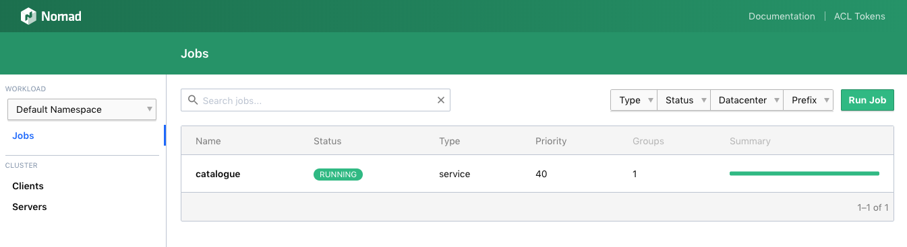
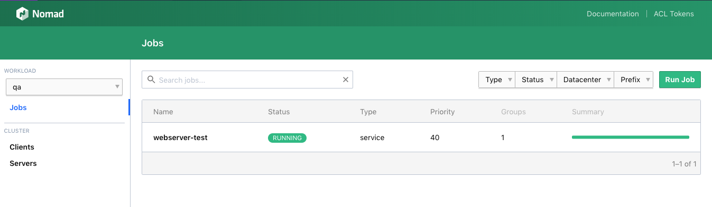

name: chapter-title
class: title, shelf, no-footer, fullbleed
background-image: url(https://hashicorp.github.io/field-workshops-assets/assets/bkgs/HashiCorp-Title-bkg.jpeg)
count: false

# Chapter 7
## Nomad Enterprise Governance and Policy


???
* This chapter covers the Nomad Governance and Policy features.

---
layout: true

.footer[
- Copyright © 2020 HashiCorp
- 
]

---
name: chapter-7-topics
# Nomad Governance and Policy Features
* Namespaces
* Resource Quotas
* Sentinel Policies
* Audit Logging

???
* The Nomad Enterprise Governance and Policy module includes Namespaces, Resource Quotas, and Sentinel Policies.
* It currently also includes Preemption of service and batch jobs, but that will probably be moved to Nomad OSS since preemption does not respect namespaces and does not work well with resource quotas.

---
name: nomad-namespaces
# Nomad Enterprise Namespaces
* [Namespaces](https://learn.hashicorp.com/nomad/governance-and-policy/namespaces) allow multiple teams to safely share a Nomad cluster.
* The jobs and tasks of one namespace are isolated from those of others.
* The namespace of a job is specified by the job's `namespace` stanza.
  * Jobs are run in the `default` namespace if none is specified.
* Nomad's ACL system restricts who can run jobs in namespaces and who can apply resource quotas and Sentinel policies.
* Resource quotas can be applied to namespaces to restrict their consumption of cluster resources.

???
* Nomad Enterprise namespaces allow multiple teams to safely share a Nomad cluster, especially when combined with Nomad Enterprise resource quotas
* Jobs that do not specify a namespace in their job specification are run in the default namespace.

---
name: nomad-namespaces-cli-commands
# Namespace CLI Commands
* Namespaces can be managed with these CLI commands:
  * `namespace list`: List all namespaces.
  * `namespace apply`: Create or update a namespace.
  * `namespace status`: Display the status of a namespace.
  * `namespace inspect`: Inspect extra details of a namespace.
  * `namespace delete`: Delete a namespace.

???
* These are the Nomad CLI commands for managing namespaces.

---
name: nomad-namespaces-ui
class: compact
# Selecting a Namespace in the Nomad UI

.center[]

.center[]

???
* After creating namespaces and running jobs in them, you can select namespaces in the upper-left corner of the Nomad UI and inspect jobs within them.

---
name: nomad-resource-quotas
# Nomad Enterprise Resource Quotas
* [Resource Quotas](https://learn.hashicorp.com/nomad/governance-and-policy/quotas) allow Nomad operators to restrict the aggregate resource consumption of namespaces.
* The most common resources restricted are CPU and Memory.
* But it is also possible to restrict network usage

???
* Nomad resource quotas allow Nomad operators to restrict the aggregate resource consumption of namespaces.

---
name: nomad-quota-cli-commands
# Resource Quota CLI Commands
* Resource quotas can be managed with these CLI commands:
  * `quota init`: Create an example resource quota.
  * `quota list`: List all resource quotas.
  * `quota apply`: Create or update a resource quota.
  * `quota status`: Display the status of a resource quota.
  * `quota inspect`: Inspect extra details of a resource quota.
  * `quota delete`: Delete a resource quota.
* A resource quota is attached to a namespace with the command `nomad namespace apply -quota <quota> <namespace>`.

???
* Here are the Nomad CLI commands for working with resource quotas.
---
name: generated-resource-quota
class: smaller, compact
# Resource Quota Generated by Init Command
```hcl
name = "default-quota"
description = "Limit the shared default namespace"

limit {
    region = "global"
    region_limit {
        cpu = 2500
        memory = 1000
        network {
           mbits = 50
        }
    }
}
```

???
* Here is what the `nomad quota init` command generates.
* You can use this as a template for defining your own resource quotas.

---
name: nomad-sentinel-policies
# Nomad Enterprise Sentinel Policies
* [Sentinel Policies](https://learn.hashicorp.com/nomad/governance-and-policy/sentinel) in Nomad restrict the characteristics of jobs submitted to Nomad.
* Sentinel policies extend and require the Nomad [ACL system](https://learn.hashicorp.com/nomad/acls/fundamentals).
* Nomad Sentinel policies can do things like:
  * Restrict which drivers are allowed.
  * Restrict which Docker images can be used.
  * Restrict which networks Docker images can use.
  * Restrict total memory used by all the task groups of a job.

???
* Nomad Sentinel policies restrict the characteristics of jobs submitted to Nomad.

---
name: sample-nomad-policy
class: compact, smaller
# Sample Nomad Sentinel Policy
```hcl
# Rule that restricts Nomad drivers
allow_docker_and_java = rule {
  all job.task_groups as tg {
    all tg.tasks as task {
      task.driver in ["docker", "java"]
    }
  }
}

# Main rule
main = rule {
  allow_docker_and_java
}
```

???
* This is a Nomad Sentinel policy that only allows the Docker and Java task drivers to be used.

---
name: nomad-enterprise-audit-logging
# Nomad Enterprise Audit Logging
* Nomad Enterprise's [Audit Logging](https://nomadproject.io/docs/enterprise/#audit-logging) provides Nomad administrators a complete set of records for all user-issued actions in Nomad.
* Nomad Enteprise customers can proactively identify access anomalies, ensure enforcement of their security policies, and diagnose cluster behavior by viewing preceding user operations.
* Each audit event is captured with relevant request and response information in a JSON format that is easily digestibile and familiar to operators

???
* Finally, we want to talk about Nomad Enterprise's audit logging that was added in Nomad 0.11.0.

---
name: lab-nomad-governance
# 👩‍💻 Nomad Enterprise Governance Lab
* In this lab, you'll learn how to use Nomad Enterprise's governance capabilities including namespaces, resource quotas, and Sentinel policies.
* You'll also enable and use Nomad ACLs since these are required in order to use Sentinel in Nomad.
* You'll do this using the Instruqt track "Nomad Enterprise Governance" at this URL:<br>
https://play.instruqt.com/hashicorp/tracks/nomad-governance

???
* Now, you can explore Nomad namespaces, resource quotas, and Sentinel policies hands-on
* You'll be running the Instruqt track "Nomad Enterprise Governance"

---
name: chapter-Summary
# 📝 Chapter 7 Summary

In this chapter you did the following:
* Learned about Nomad Enterprise's governance features including namespaces, resource quotas, Sentinel policies, and audit logging.
* Actually worked with the first 3 of these constructs and Nomad ACLs in an Instruqt lab.

???
* You now know a lot more about Nomad Enterprise's governance features than you did yesterday.
