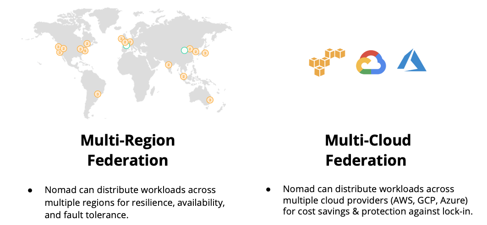

name: chapter-title
class: title, shelf, no-footer, fullbleed
background-image: url(https://hashicorp.github.io/field-workshops-assets/assets/bkgs/HashiCorp-Title-bkg.jpeg)
count: false

# Nomad Federation and Multi-Region Job Deployments

???
This is a title slide for the Nomad Federatio and Multi-Region Job Deployments chapter.

---
layout: true

.footer[
- Copyright © 2021 HashiCorp
- 
]

---
name: chapter-federation-topics
# Nomad Federation and Multi-Region Deployments
* In this chapter, you'll learn about the following topics:
  * Nomad Federation
  * Nomad Multi-Region Job Deployments
* Note that the second feature requires Nomad Enterprise 0.12 or higher.
* You'll also be doing a hands-on lab that covers these topics.

???
* The Nomad Federation and Multi-Region Deployments chapter covers Nomad Federation and Multi-Region Job Deployments.
* The second feature requires Nomad Enterprise 0.12 or higher.

---
name: federation-made-real
# Federation Made Real
.center[]

???
* Nomad can deploy applications seamlessly to federated clusters across multiple clouds.
* It is the first and only orchestrator on the market with complete and fully-supported federation capabilities for production.

---
name: clusters-regions-datacenters
class: compact
# Nomad Datacenters, Regions & Clusters
* Nomad organizes Nomad servers and clients into datacenters and regions.
* Nomad **Datacenters** are physical or logical groups of compute resources typically defined by cloud service providers as availability zones.
* Nomad **Regions** consist of one or more Nomad datacenters.
* All the Nomad servers and clients in a Nomad region belong to a single Nomad **Cluster**.
* So, Nomad regions and clusters have a 1:1 relationship.
* Multiple Nomad Regions can be **Federated** together.
* Federated clusters communicate via **WAN Gossip**.

???
* Nomad organizes Nomad servers and clients into datacenters and regions.
* Regions contain Datacenters.
* Each region constitutes a single cluster.

---
name: federation-diagram
# Two Federated Nomad Regions

.center[]

???
* This diagram shows a high-level overview of two federated Nomad regions.

---
name: federating-clusters-1
# Federating Nomad Clusters (1)
* Federating Nomad clusters requires that servers in the clusters can communicate between the clusters using Nomad's RPC and Serf protocols.
* When two or more Nomad clusters are federated, users can submit jobs to any region from any other region.
* Nomad Enterprise even supports **Multi-Region Job Deployments** to multiple, federated regions from a single job specification file.

???
* Federating Nomad clusters requires network connectivity, specifically RPC and Serf.
* Users can submit jobs from any cluster to any other federated cluster.
* Nomad Enterprise even supports Multi-Region Job Deployments from a single job specification file.

---
name: federating-clusters-2
# Federating Nomad Clusters (2)
* The configuration files for all Nomad servers and clients in a region should set the `region` parameter to the name of that region.
* All Nomad servers and clients should be restarted if the `region` was changed.
* Federate the regions with the `nomad server join` command in one region, specifying the IP address of any server in the other region and the WAN Gossip (Serf) port, `4648`.
  * `nomad server join 172.31.26.138:4648`
* This only needs to be run once for each pair of federated clusters.

???
* The configuration files for all Nomad servers and clients should set the `region` parameter.
* Federate the regions with the `nomad server join` command

---
name: federated-servers
# Federated Servers
* After clusters are federated, all servers in all of the clusters will show up when running the `nomad server members` command:
.center[]
* But the `nomad node status` command will still only show Nomad clients from the targeted region.
* Nomad CLI and HTTP API commands can target any region with the `region` parameter.

???
* After clusters are federated, all servers in all of the clusters will show up when running the `nomad server members` command.
* But this is not true of the `nomad node status` command.
* CLI and HTTP API commands can target regions with the `region` parameter (`-region` for the CLI, `?region` for the HTTP API).

---
name: multiregion-deployments
class: compact
# Multi-Region Job Deployments
* Nomad Enterprise supports deployments to multiple regions in a single job.
* This is implemented with the [multiregion](https://www.nomadproject.io/docs/job-specification/multiregion) stanza.
* This stanza should specify one `strategy` stanza and a `region` stanza for each region.
  * The `strategy` stanza indicates whether deployments should be serialized or parallel and what should happen when a deployment fails in a region.
  * The `region` stanza indicates the `count` that should be used for task groups in each region and which datacenters are eligble.

???
* The multiregion stanza is used to create a multi-region job.
* The strategy stanza determines the parallelism of deployments across regions and how failures should be handled.

---
name: multiregion-deployment-failures
class: compact
# Handling Multi-Region Deployment Failures
* The `on_failure` parameter of the `strategy` stanza of the `multiregion` stanza controls what happens when a deployment fails in a region.
* It can be left unset or set to `fail_all` or `fail_local`.
* When it is not set, the region with the failure and all subsequent regions are marked as `failed`.
* When it is set to `fail_all`, the entire deployment will be marked as `failed`.
* When it is set to `fail_local`, only the region with the failure is set to `failed`.
* Blocked regions can be unblocked with the `nomad deployment unblock` command.
* Each `failed` region follows the `auto_revert` strategy of its own `update` stanza.

???
* If `on_failure` is not set, the region with the failure and all subsequent regions are marked as `failed`.
* If it is set to `fail_all`, the entire deployment will be marked as `failed`.
* If it is set to `fail_local`, only the region with the failure will be marked as `failed` while other regions will be marked as `blocked`.
* Blocked regions can be unblocked with the `nomad deployment unblock` command.
*

---
name: lab-multi-region-deployments
# 👩‍💻 Nomad Multi-Region Job Deployments Lab
* In this lab, you'll federate two Nomad regions (clusters).
* Then, you'll deploy a Nomad job across the two regions.
* You'll also see what happens when a multi-region job fails in one region and use the `nomad deployment unblock` command.
* You'll do this using the Instruqt track [Nomad Multi-Region Federation](https://play.instruqt.com/hashicorp/invite/dgpya4wz0c2z).

???
* Now, you can explore Nomad's federation and multi-region job deployments hands-on.
* You'll be running the Instruqt track "Nomad Multi-Region Federation".
---
name: chapter-Summary
# 📝 Chapter Summary

In this chapter you did the following:
* Learned about Nomad Federation.
* Learned about Nomad Enterprise's ability to deploy a job across multiple regions.
* Actually federated two Nomad regions and deployed a multi-region job across them in an Instruqt lab.

???
* You now know a lot more about Nomad's federation and multi-region job deployments than you did yesterday.
