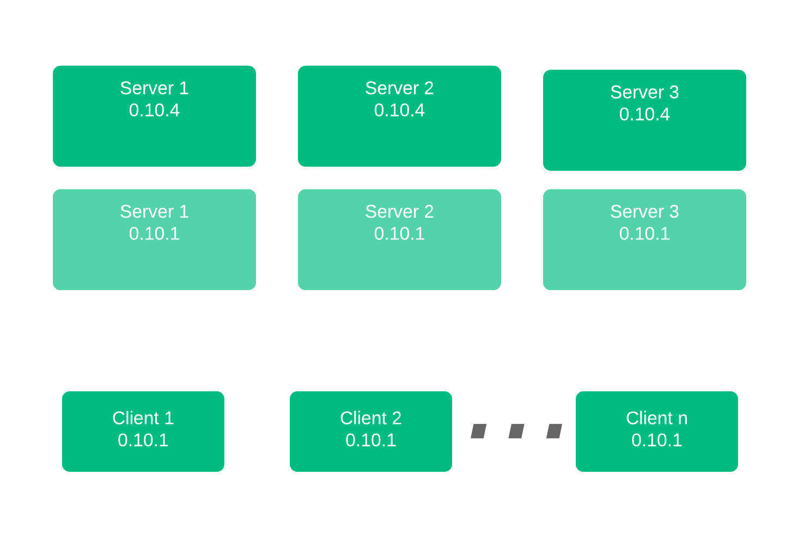

name: nomad-enterprise-workshop-part-3
class: title, shelf, no-footer, fullbleed
background-image: url(https://hashicorp.github.io/field-workshops-assets/assets/bkgs/HashiCorp-Title-bkg.jpeg)
count: false

# Chapter 3
## Nomad Autopilot - Upgrades, Scalability, and Redundancy Zones

???
This section discusses Nomad's ability to automatically upgrade an entire cluster of Nomad servers in an automatic and controlled fashion. This can sometimes be referred to as "upgrade migration"

---
layout: true

.footer[
- Copyright © 2020 HashiCorp
- 
]

---
name: Nomad Enterprise Features - Autopilot
# Nomad Enterprise - Autopilot

* Autopilot is a function that enables multiple features
    * Automated Upgrades/Upgrade Migration
    * Enhanced Read Scalability
    * Redundancy Across Availability Zones

???
- Autopilot enables multiple features within Nomad Enterprise.
- This section focuses on Automated Upgrades, Read Scalability, and Redundancy Zones

---
name: Automated Upgrade Overview
# Upgrade Process

* Add New Servers to Cluster with Updated Versions
* Autopilot won't promote new Servers until Quorum Achived
* Once Quorum Achived, Autopilot pomotes new Servers, demotes old servers
* Autopilot can remove old servers from cluster automatically
* Upgrade complete!

???
- This section discusses Nomad's ability to automatically upgrade an entire cluster of Nomad servers in an automatic and controlled fashion.
- Sometimes be referred to as "upgrade migration"

---
class: img-right
name: Automated Upgrade Flow 1
# Upgrade Process

.smaller[
* Existing Cluster, all on 0.10.1
]

???
- This section discusses Nomad's ability to automatically upgrade an entire cluster of Nomad servers in an automatic and controlled fashion.
- Sometimes be referred to as "upgrade migration"
- Starting with a basic cluster, all on the same version

---
class: img-right
name: Automated Upgrade Flow 2
# Upgrade Process

.smaller[
* Existing Cluster, all on 0.10.1
* New Servers Introduced
]

???
- New Servers are introduced with newer version
- Great use of Terraform

---
class: img-right
name: Automated Upgrade Flow 3
# Upgrade Process

.smaller[
* Existing Cluster, all on 0.10.1
* New Servers Introduced
* Quorum Achieved, Old Servers Demoted
]

???
- Once enough new servers are introduced, quorum achieved
- Nomad automatically demotes old servers
- Note:  This is default operation and can be overridden

---
class: img-right
name: Automated Upgrade Flow 4
# Upgrade Complete

.smaller[
* Existing Cluster, all on 0.10.1
* New Servers Introduced
* Quorum Achieved, Old Servers Demoted
* Old Servers Removed
]

???
- Once the new servers have been promoted old servers can be decommissioned

---
name: Scaling Readbility
# Increasing Read Scalability

* Add Non-Voting Servers to Cluster
* Receives Replicated Data, But Never Promoted
* Improves Scheduling Abilities and Read Performance
* Configured in server Stanza with `non_voting_server` Parameter

---
name: Nomad Redundancy Zones
# Nomad Redundancy Zones

* Without Redundancy Zones
    * Server Cluster in each Availability Zone (3-5 machines per zone)
    * Or give up redundancy with a single Server in each Zone
* With Redundancy Zones
    * Servers are associated with Availability Zones
    * Nomad keeps one voting server in each Zone
    * Cluster Functionality retained across Availabity Zone Failures

???
- Redundancy Zones allows servers to be associated with a zone, and enables clusters to communicate across zones
- Without Redundancy Zones, each Zone would have an independent cluster, or just forego server redundancy
- Using Nomad Autopilot with Redundancy Zones ensures cluster operation continuity in the event of zone failures