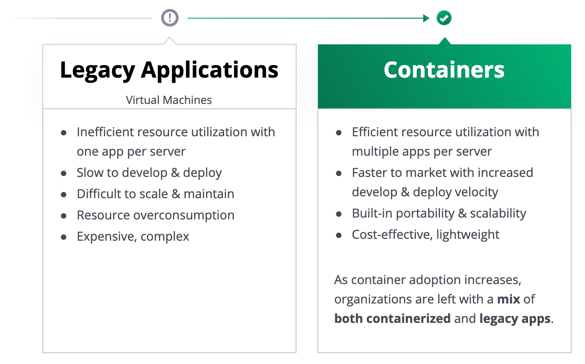

name: nomad-overview
class: title, shelf, no-footer, fullbleed
background-image: url(https://hashicorp.github.io/field-workshops-assets/assets/bkgs/HashiCorp-Title-bkg.jpeg)
count: false

# Chapter 1
## Nomad Overview

???
* In this chapter, we'll provide an overview of Nomad

---
layout: true

.footer[
- Copyright © 2019 HashiCorp
- 
]

---
name: chapter-1-topics
# Chapter 1 Topics

1. Nomad's Place in the HashiStack
1. Nomad's Business Value
1. What is Nomad?
1. Nomad Use Cases
1. Nomad OSS Features
1. Nomad Enterprise Features

???
- Topics discussed in Chapter 1

---
name: chapter-1-nomad-place-in-hashistack
# Nomad's Place in the HashiStack
.center[]

???

- Organizations can use Nomad to run their containerized workloads across any cloud or onprem.

---
name: chapter-1-nomad-business-value
# Nomad's Business Value
.center[]

???
-  Lowers total cost of ownership (TCO) via bin packing
-  Runs both containerized and legacy apps (e.g. Java classes and jars)
-  Easy to operate and maintain

---
name:  chapter1-what-is-nomad
# What is Nomad
.smaller[
* A flexible, lightweight, high performing, easy to use orchestrator
* Used to deploy and manage containers and legacy applications simultaneously
* Works across data centers and cloud platforms, providing universal scheduling
* Manages services, batch functions, as well as global system services
]

???
- Runs as a single binary in just about any environment - one of the easiest and lightweight service scheduler and manager available.
-  Used to deploy both container applications, as well as legacy applications such as Java or raw executables.
-  As an independent function, Nomad can run and communicate across data centers, and cloud platforms.  Truly cloud agnostic.
-  Can manage individual services, batch functions, or even global system services such as monitoring functions.

---
name: chapter-1-nomad-use-cases
# Nomad Use Cases
.center[]

???
- Container Workloads
- Legacy Applications
- Batch Jobs like Machine Learning

---
name: chapter-1-nomad-oss-features
# Nomad Open Source Features

1. Nomad Open Source Features

???
- This is our OSS Features slide.

---
name: chapter-1-nomad-enterprise-features
# Nomad Enterprise Features

1. Nomad Enterprise Features

???
- This is our Enterprise Features slide.
