name: nomad-chapter-2-title
class: title, shelf, no-footer, fullbleed
background-image: url(https://hashicorp.github.io/field-workshops-assets/assets/bkgs/HashiCorp-Title-bkg.jpeg)
count: false

# Chapter 2
## Nomad Concepts and Architecture

???
Nomad is a highly advanced service scheduler and manager.  Within this slide deck, we'll be reviewing some of the more advanced concepts and architecture behind Nomad.

---
layout: true

.footer[
- Copyright © 2020 HashiCorp
- 
]

---
name: chapter-2-topics
# Chapter 2 Topics

1. Key Nomad Concepts
2. Nomad Architecture
3. Nomad Scheduling
4. Nomad Integrations

???
* This is our chapter topics slide.

---
name:  What Is Nomad
# What is Nomad?
.smaller[
* A flexible, lightweight, high performing, easy to use orchestrator
* Used to deploy and manage containers and legacy applications simultaneously
* Works across data centers and cloud platforms, providing universal scheduling
* Manages services, batch functions, as well as global system services
]

???
- Runs as a single binary in just about any environment - one of the easiest and lightweight service scheduler and manager available.
-  Used to deploy both container applications, as well as legacy applications such as Java or raw executables.
-  As an independent function, Nomad can run and communicate across data centers, and cloud platforms.  Truly cloud agnostic.
-  Can manage individual services, batch functions, or even global system services such as monitoring functions.

---
name:  Common Nomad Concepts
# Nomad Concepts (1)

.smaller[
* Nomad **Clusters** consist of nodes running the Nomad binary, both Servers and Clients, in a single region
* **Servers** provide the intelligence (scheduling, allocation) to the cluster
* **Clients** register with the servers and execute scheduled tasks.
* **Jobs** are submitted by users and represent the desired state of the associated workloads
* **Drivers** are used by Nomad to execute tasks (i.e., Docker, Exec, Java, etc.)
* **Tasks** are the smallest unit of work executed by drivers
* **Task Groups** are groups of tasks (shocking) that must run together (cannot be split across clients)
]

???
-  Cluster contains anywhere from 3-5 server nodes, and an unconstrained number of client nodes.
-  All nodes run the same Nomad binary.
-  Nomad server nodes provide the brains and intelligence to the cluster, performing all scheduling and allocations
-  Clients execute the tasks as directed by the server cluster.
-  Jobs are used to describe the desired state of the workloads.
-  Drivers for docker containers, java apps, and arbitrary executables execute the defined tasks
-  Task Groups are groups of tasks that must be run together, often colocated on the same client -  may be required for various architectural reasons.

---
name:  More Nomad Concepts
# Nomad Concepts (2)

.smaller[
* **Allocations** map the tasks and task groups within jobs to client nodes
* Nomad performs **Evaluations** whenever jobs or client states change to determine if allocations must be adjusted
* Nomad maximizes resource utilization with a highly efficient **Bin Packing** algorithm
* **Datacenters** are physical or logical groups of compute resources typically defined by cloud service providers
* **Regions** are Nomad logical constructs that may consist of multiple datacenters, and contain one Nomad cluster
* Multiple Nomad Regions can be **Federated** together
]

???
-  Allocations map tasks, task groups, and jobs to various client resources.
-  Allocations are adjusted based on Nomad Evaluations that are performed whenever balance within the system is disrupted, either through adjustments to the job, and/or changes to the client availability.
-  Nomad uses a highly efficient bin packing algorithm to ensure that resource utilization is maximized across the client cluster.
-  A cluster can reside within a traditional datacenter, or across multipledata centers defined as a Nomad region.
- Regions can be federated together enabling wider communication without replicating data across all regions.

---
name:  Deployment Architecture
# Typical Deployment Architecture

.smaller[
* Single binary provides both Client and Server function
* 3-5 Servers per Nomad Cluster
* Servers elect 'Leader' to manage priorities, evaluations, and allocations
* Clusters can transcend Data Centers
]
.center[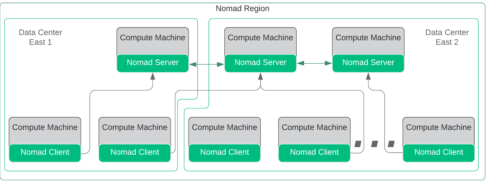]

???
-  Nomad utilizes a single binary application that can be run as a client or server.
-  A server cluster should utilize 3-5 server nodes.
-  Servers communicate via the Gossip protocol, and use Consensus protocol to elect a leader
-  A single cluster of servers operate in a single region, which may consist of one or more data centers.

---
class: img-right
name:  Nomad Cluster Leader Election and Viability
# Cluster Leader Election and Viability

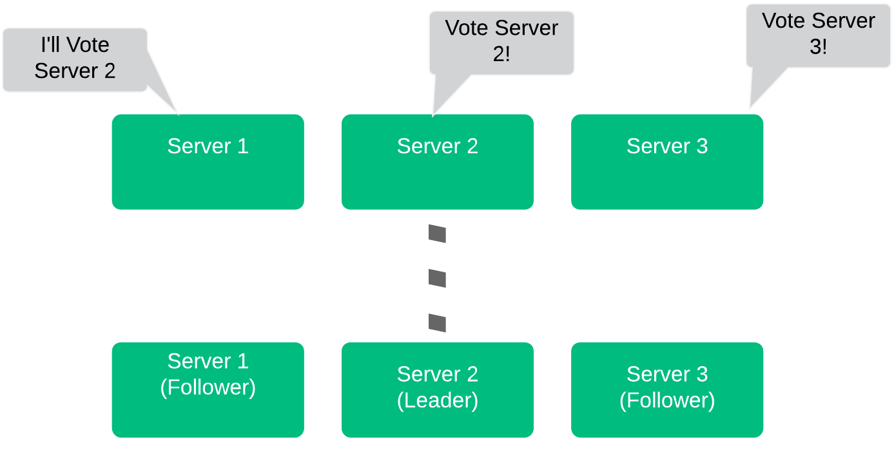

.smaller[
* Servers race to claim candidacy
    * Server 2 announced first, asked for vote
* Server 1 heard server 2 first
    * Votes for server 2
* Server 3 loses vote, becomes follower, Server 1 wins and becomes Leader
]

.smaller.center[3 Servers can sustain 1 Failure, 5 servers can sustain 2 failures]

???
-  When servers initialize, they need to find eachother and create a leader.
-  A server will promote itself as a candidate to be a leader, and notify the other servers in the cluster.
-  Once the candidate has a quorum of votes, it will promote itself as the leader.
-  With 3 server nodes, the cluster can sustain a single failure.  With 5 server nodes, the cluster can sustain two failures.
-  Note that as you increase server members, it will take longer for the consensus protocol to converge and elect a leader.

---
name:  Multi-region Federation
# Operating Across Regions

.smaller[
* Multiple Nomad Regions can be Federated Together
* Jobs are submitted within region, and can be submitted across regions
* ACL Tokens, Policies, and Sentinel Policies are shared across regions - Application/State Data NOT Shared
]

.center[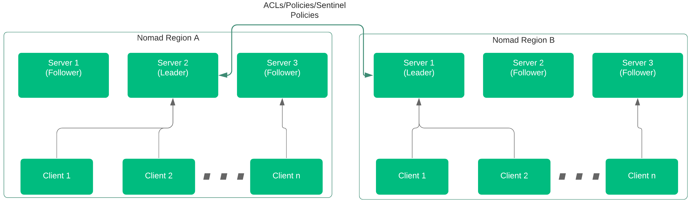]

???
- Clusters can federate across regions using WAN Gossip
- Only ACL, Policies, and Sentinel Policies are shared across regions (no application data).

---
name:  Multi-region Federation
# Region Server Failure

.smaller[
* If all servers in a region fail, clients can access servers in a federated region
* Servers must be discoverable
* Requires RPC and Raft across Regions
]

.center[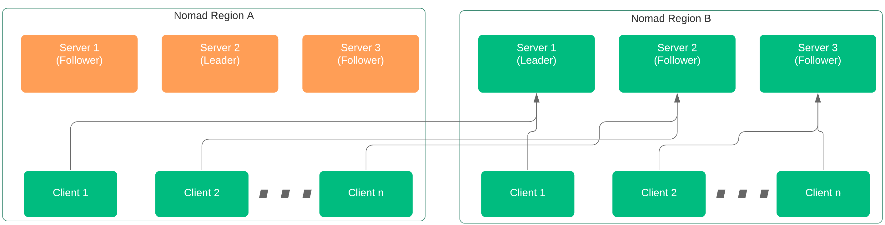]

???
-  If the server cluster in one region goes down completely, the server cluster in another region can facilitate management.
-  This multi-region federation requires RPC and Serf support across regions.

---
class: img-right
name:  Nomad Layout and Comms
# Nomad Communications

.smaller[
* 3-5 Server Nodes
* The Leader Replicates to Followers
* Followers forward Client Data and Requests to Leader
* Servers send Allocations to clients
* Clients Communicate with all Servers over RPC
]

???
-  Within the Server Cluster, we have a Leader, and we have Followers.
-  Leaders are elected via quorum (which is why it is important to have 3-5 nodes) using Consensus, based on RAFT.
-  Leader of the servers makes all allocation decisions, and distributes to Followers.
-  Server push allocation and task assignments via RPC to each Server.

---
name: Nomad Scheduler Section
class: title, shelf, no-footer, fullbleed
background-image: url(https://hashicorp.github.io/field-workshops-assets/assets/bkgs/HashiCorp-Title-bkg.jpeg)
count: false

# Nomad Scheduler Processes
## Evaluations, Allocations, Priorities, and Preemption

???
Focusing more on the Scheduler process

---
class: img-right
name:  Nomad Evaluation
# Nomad Scheduler Initiation - Evaluations

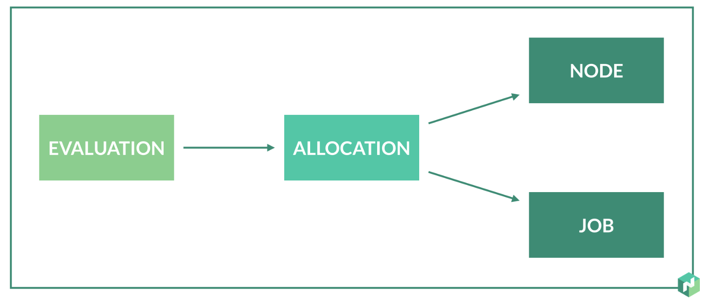

An Evaluation is "Kicked Off" whenever ANY of the following occur
.smaller[
* New Job Created
* Job Updated or Modified
* Job or Node Failure
]

???
-  Evaluations to determine if any work is necessary.
-  Evaluation is initiated by a new job definition, an updated job definition, or some change to the infrastructure.
-  If necessary, a new Allocation maps tasks or task groups within jobs, to the available nodes

---
class: img-right

name:  Nomad Scheduler
# Nomad Scheduler Initiation

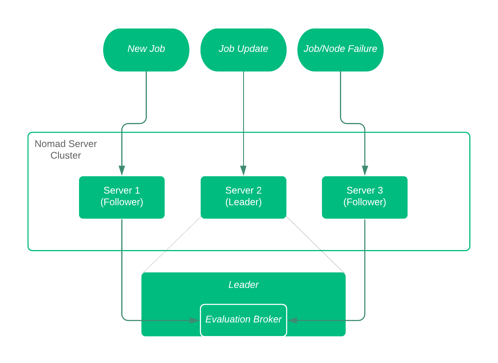

.smaller[
* Regardless of how the Evalution is initiated, the evaluation can be sent to any of the server nodes.
* All Evaluations are forwarded to the Evaluation Broker on the Leader
* Evaluation remains in 'pending' state until the Leader queues the process
]

???
-  A new job, a modified or updated job, or any change in the system (job or node failure) will cause an evaluation to kick off.
-  Any of the server nodes can receive the evaluation request.
-  Evaluations are forwarded to a dedicated process on the Leader, called the evaluation broker.
-  Evaluation remains in 'pending' state until broker decides upon allocation

---
class: img-right

name:  Nomad Evaluation
# Nomad Evaluation
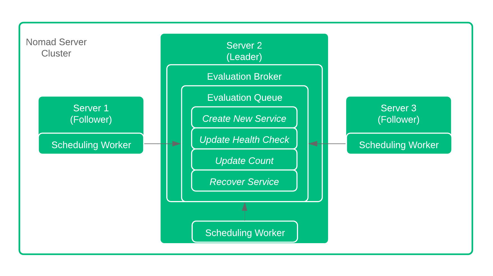

Once the Evaluation Broker recieves the Evaluations, the Broker queues the changes in order based on priority.

Scheduler on Follower Nodes pick the Evaluations off the queue and start planning!

???
-  Here the evaluation Broker, residing on the leader node, manages the queue of pending evaluations.
-  Priority is determined based on Job definition
-  Broker ensures that somebody picks up the evaluation for processing.
-  Once the evaluation is picked up by a Scheduler, the planning begins!

---
name:  Scheduling Workers
# Scheduler Operations

All Servers run Scheduling Workers
* One Scheduler per CPU core by default
* Four Default Schedulers Available
    * **Service** Scheduler optimized for long-lived services
    * **Batch** Scheduler for fast placement of batch jobs
    * **System** Scheduler for jobs to run on every node

???
-  Each server node runs one scheduler per CPU core.
-  Server chooses the proper scheduler, either for standard services, batch jobs, or system level jobs.

---
name:  Scheduler Function Part 2
# Scheduler Processing
Now that the Scheduler has the job, let's look at what the it does...
.smaller[
1.  Identify available resources/nodes to run the job
2.  Rank nodes based on bin packing and existing tasks/jobs
3.  Select highest ranking node, and create allocation plan
4.  Submit allocation plan to leader
]
???
-  Server process has several steps
-  First it identifies the potential nodes, or available resources, that could accept the job.
-  Next take a look at the ideal nodes, based on bin packing and existing tasks.
   -  Bin packing ensures the most efficient usage of the resources.
-  Taking existing tasks into account minimizes co-locating tasks on the same servers.
-  Highest ranking node is chosen, the allocation plan is created, and submitted back to the Leader.

---
class: img-right
name:  Plan Queue Processing
# Plan Queue Processing
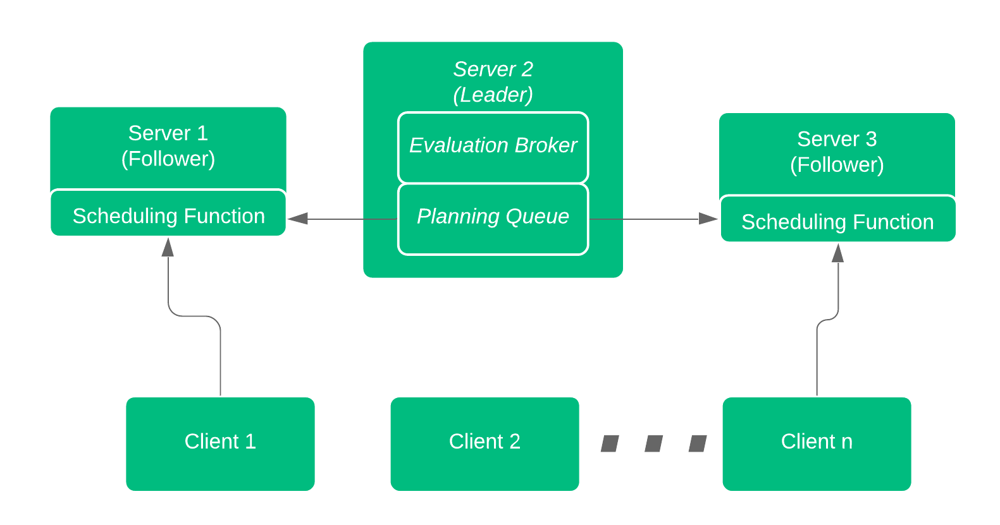

Back to the leader now...
.smaller[
5.  Evaluate all submitted allocation plans
6.  Accept, reject, or partially reject the plan
7.  Return response to Scheduler for implementation, rescheduling, or termination
8.  Scheduler updates status of evaluation and confirms with Evaluation Broker
9.  Clients pick up allocation changes and act!
]

???
-  Leader makes final determination for allocation.
-  All pending plans are prioritized and eliminate any concurrency if it exists.
-  Leader will either accept or reject (or partial reject) the plan.
-  Scheduler can chose to reschedule or terminate the request
-  Scheduler updates the Evaluation Broker with the decision, and clients pick up any changes deemed necessary

---
name:  End to End Flow
#  Flow Recap
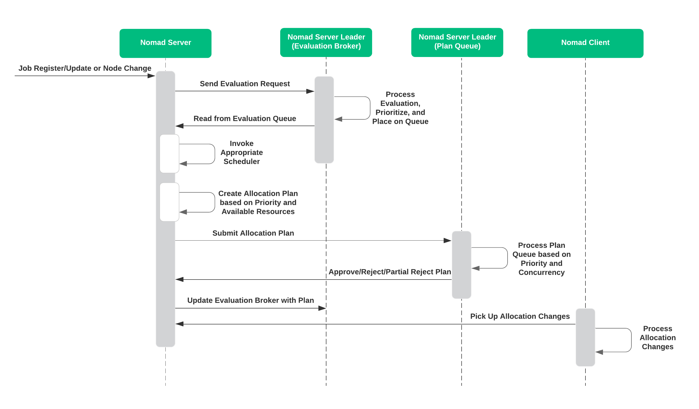

---
name:  Job Priority
# Job Priority
* Every Scheduler, Planner, Program Manager, deals with struggling priorities.
* **Nomad** is no different - Priority is processed during evaluation and planning
.smaller[
* Every job has an associated Priority
* Priority ranges from 1-100
* Higher number = higher priority
]

.center[What if higher priority jobs are scheduled?]

???
-  Nomad supports priority configuration with every Job, from 1 to 100.
-  The higher the number, the higher the priority.
-  What if a higher priority job is scheduled and resources are limited?

---
name:  Preemption
# Preemption in Nomad
.center[Preemption allows high-priority jobs to replace  other jobs.]
.smaller[
| Without Preemption            | With Preemption                  |
|-------------------------------|-------------------------------------------------|
|Jobs and tasks are allocated first come - first served |Evaluations performed regardless of resource availability |
|Pending Evaluations not allocated until resources available                   |Lowest priority jobs evicted if necessary|
|             |Output of 'Plan' identifies any preemptive actions|
]

???
-  Jobs are evaluated and allocated as they are delivered to the evaluation broker.
-  If resources aren't avialable, any evaluations will be stuck in pending state until resources become available.
-  With preemption, Nomad evicts lowest priority jobs if necessary.
-  Any preemption actions necessary are highlighted as an output of the 'Plan' operation

---
class: col-2
name:  How Preemption Works
layout: false
# Preemption Details

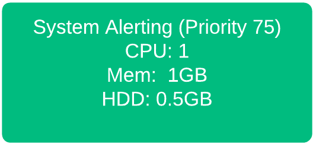
.center[We want to add the System Alerting app, but there's no room!]

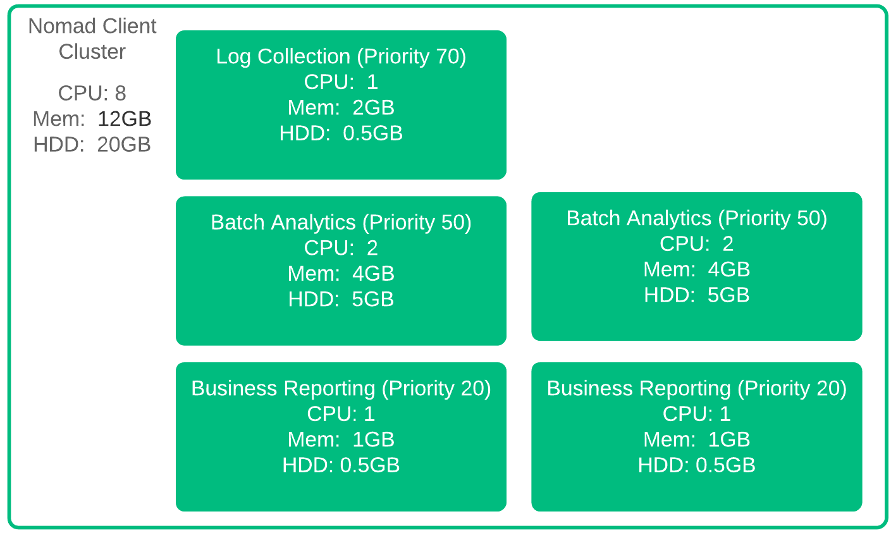
.center[The Nomad cluster is already using all 12GB of memory!]

???
* Let's run through a quick example of how preemption works.
* Here we have a Nomad cluster with a few allocations in an analytics solution.
* All allocations are all happy, and now we have a new job added to the system for System Alerting.
* We have enough CPU, and plenty of Hard Drive, but we are at the memory limit.
* There's no room at the inn for our System Alerting process.  
* Without Preemption, that's where we would stop.
* But we have preemption, so we'll continue

---
class: col-2
name:  How Preemption Works 2
layout: false
# Preemption Details 2

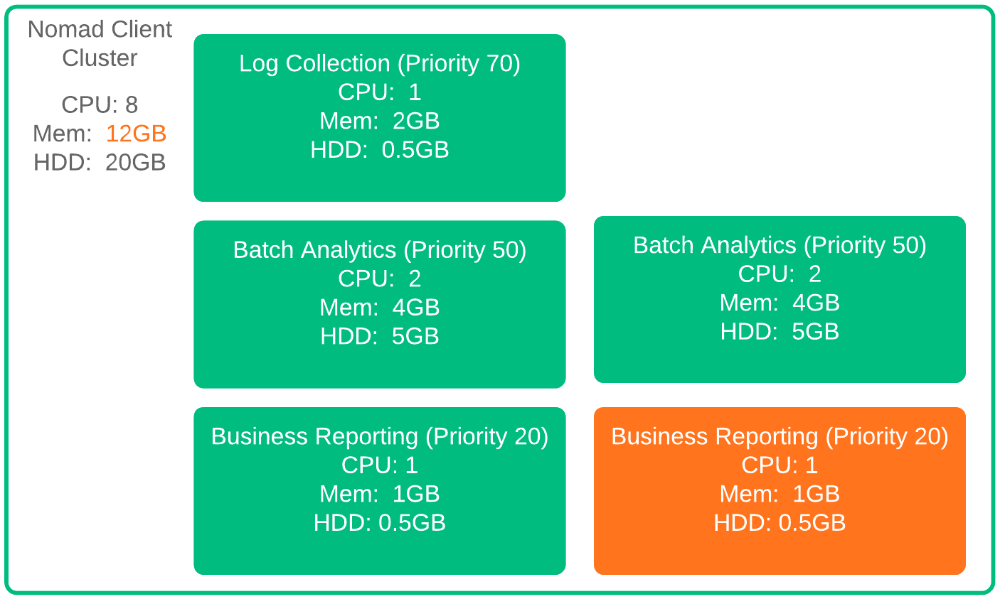
.center[One of the Business Reporting apps needs to go!]

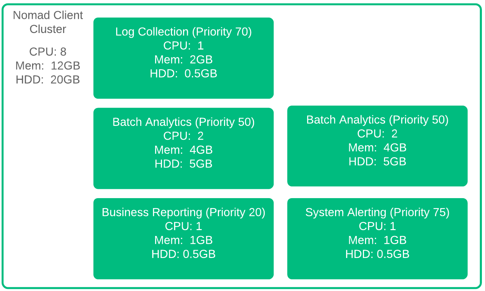

???
With Preemption, Nomad realizes that there are lower priority allocations that can be evicted.  So if we are adding one System Alerting job, we evict one Business Reporting Job.  The Business Reporting job has the lowest priority, so it gets evicted first.  But what happens if we have to add two more System Alerting allocations?

---
class: col-2

name:  How Preemption Works 3
# Preemption Details 3

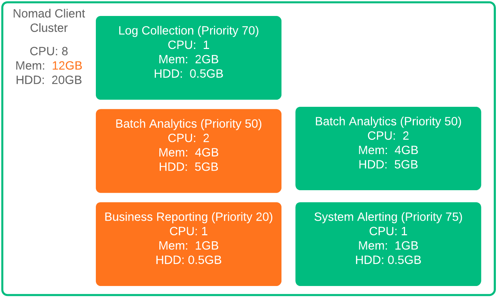
.center[More System Alerting means more eviction.]
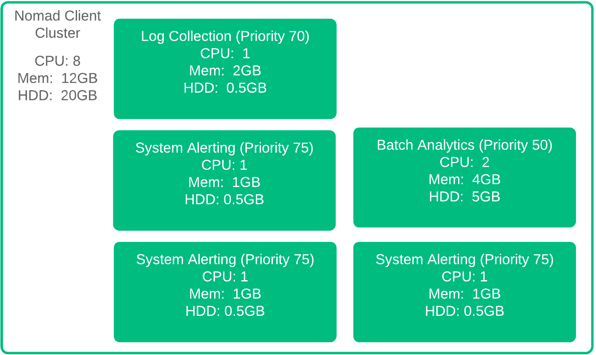
 .center[Log Collection isn't a candidate since priority delta < 10.]

???
* If we add two more Sytem Alerting allocations, we need to bump a Batch Analytics Allocation as well.
* Evicting the Log Collection allocation would be sufficient, but the Batch Analytics Allocation has a lower priority.
* Additionally, as the priority difference between System Alerting and Log Collection is less than 10, the Log Collection allocation isn't a candidate for preemption with respect to System Alerting.
---
name: Nomad within HashiCorp
class: title, shelf, no-footer, fullbleed
background-image: url(https://hashicorp.github.io/field-workshops-assets/assets/bkgs/HashiCorp-Title-bkg.jpeg)
count: false

# Nomad Integrations
## The HashiCorp Ecosystem

???
Nomad integrates well with other HashiCorp products.  We're just going to touch on the functionality here.

---
layout: true

.footer[
- Copyright © 2020 HashiCorp
- 
]

---
name:  Nomad and Consul
# Nomad's Native Integration with Consul

* Consul enables:
  * Automatic clustering of Nomad servers and clients
  * Service discovery for tasks
  * Dynamic configuration for applications run by tasks.
* Consul Connect enables:
  * Secure communication between jobs and task groups

???
-  Nomad Servers and Clients can automatically find each other within the network, minimizing configuration and being more address-flexible.
-  Consul enables application service nodes to be automatically discoverable within the cluster
-  Configuration files can be dynamically created utilizing environment variables or even Vault secrets with templating
-  Consul Connect can secure communication between services deployed in public or private clouds.

---
name:  Nomad and Vault
# Nomad's Native Integration with Vault

* Nomad creates and distribute Vault tokens to tasks.
* Nomad tasks retrieve secrets and service credentials from Vault.
* Tasks access services with short-lived credentials dynamically generated by Vault.
* Tasks can also retrieve Nomad API tokens using Vault's  [Nomad Secrets Engine](https://www.vaultproject.io/docs/secrets/nomad/index.html).

???
-  Nomad's integration with Vault allows Vault tokens to be used by Nomad Tasks
-  Nomad's tasks can retrieve secrets directly from Vault
-  Vault can also provide short-lived credentials to Nomad tasks
-  Vault offers a native Nomad Secrets Engine

---
name: chapter-2-summary
# 📝 Chapter 2 Summary
In this chapter, you learned about:
  * Key Nomad Concepts
  * Nomad's Architecture
  * Nomad's Scheduling Processes
  * Nomad Integrations with Vault and Consul
