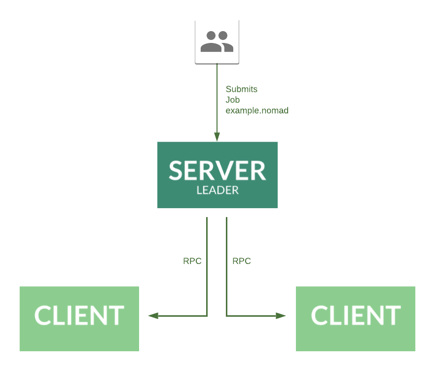

name: nomad-chapter-5-title
class: title, shelf, no-footer, fullbleed
background-image: url(https://hashicorp.github.io/field-workshops-assets/assets/bkgs/HashiCorp-Title-bkg.jpeg)
count: false

# Chapter 5
## Running Nomad Clusters and Jobs


???
* In this chapter, we'll discuss how to run Nomad servers, clusters, and jobs

---
layout: true

.footer[
- Copyright © 2020 HashiCorp
- 
]

---
name: chapter-5-topics
# Chapter 5 Topics

1. Configuring and Running Nomad Servers
2. Configuring and Running Nomad Clients
3. Clustering Servers and Clients
4. Running Nomad Jobs
5. Monitoring Nomad Clusters and Jobs
6. Modifying Nomad Jobs

???
* In this chapter, we will discuss configuring and running Nomad servers, clients, and jobs.
* We'll also learn about different ways of joining servers and clients in clusters and how to modify jobs.

---
name: chapter-5-summary
# Where are We and Where are We Going?

* We already learned about Nomad servers, clients, clusters, and jobs in Chapter 2.
* We even ran a Nomad Dev Agent and a simple job in the [Nomad Basics](https://instruqt.com/hashicorp/tracks/nomad-basics) lab.
* But we did not have to do any configuration of that agent.  
* In this chapter, we will learn how to configure and run Nomad servers and clients and how to connect them in clusters.
* We'll also learn how to modify and re-run Nomad jobs.

???
* We've learned a little about Nomad servers, clients, clusters, and jobs.
* But there is more.
* In particular, we want to learn how to configure Nomad servers and clients and cluster them.
* We also want to learn how to modify and re-run jobs.

---
name: nomad-server-review
class: smaller
# Review of Nomad Clusters, Servers, and Clients
* Nomad organizes infrastructure into **Datacenters** within **Regions**.
* Each Nomad Region always runs a single Nomad **Cluster** even if it has multiple Datacenters.
* Nomad **Servers** are the brains of a Nomad Cluster.
* They manage all jobs and clients in the region, run evaluations, create task allocations, assign these allocations along with their task groups to clients, and replicate state between each other.
  * Nomad Servers run the Nomad agent with `server.enabled` set to `true` in their configuration files or are started with the `-server` CLI argument.
* Nomad **Clients** run the task groups and tasks of Nomad jobs assigned to them by servers.
  * Nomad Clients run the Nomad agent with `client.enabled` set to `true` in their configuration files or are started with the `-client` CLI argument.

???
* Let's review what Nomad clusters, servers, and clients are and how they differ.
* First, we need to understand that servers and clients are organized into datacenters and regions with one cluster per region.
* Whether a Nomad agent (and the machine) it runs on is a Nomad server or client depends on how it is configured or on the CLI arguments used to start it.

---
name: nomad-server-configuration
class: smaller
# Nomad Server Configuration
Here is a typical Nomad Server configuration:

```hcl
server {
  enabled = true
  bootstrap_expect = 3
  server_join {
    retry_join = ["nomad-server-1"]
  }
}
```

`enabled = true` specifies that the agent should run as a server.<br>
`bootstrap_expect = 3` specifies the number of server nodes to wait for before leader election.
`retry_join` indicates which other server or servers to connect to.

???
* This slide shows the key portion of a Nomad HCL configuration file that makes an agent run as a server.
* It also shows the important `bootstrap_expect` setting that determines how many servers should the cluster should run before any server tries to become a leader.
* It also shows the `retry_join` setting that tells the server what other server or servers to cluster with.

---
name: nomad-client-config
class: smaller
# Nomad Client Configuration
Here is a typical Nomad Client configuration:

```hcl
client {
  enabled = true
  servers = ["nomad-server-1"]
}
```

`enabled` specifies that the agent should run as a client.<br>
`servers` indicates which server or servers to connect to.

???
* This slide shows the key portion of a Nomad HCL configuration file that makes an agent run as a client.
* It also shows the `servers` setting that tells the client what server or servers to connect to.

---
name: job-specification
class: compact, smaller
# Job Specification

* A **Job Specification** is given by an HCL file that defines the workloads that the job should run.
* We'll learn more about job specifications in Chapter 5.
* Here is part of the job specification you will create in this chapter's lab:

```hcl
job "redis" {
  group "cache" {
    task "redis" {
      driver = "docker"
      config {
        image = "redis:3.2"
      }
    }
  }
}
```
???
* This slide shows part of the job specification you will create in this chapter's lab.
* We see that it will run a Redis Docker container.

---
name: lab-nomad-simple-cluster-track
# 👩‍💻 Lab 5: Nomad Simple Cluster
* Now, you'll have a chance to configure and run your first Nomad cluster.
* You'll run a simple Nomad cluster consisting of 1 server and 2 clients in the "Nomad Simple Cluster" Instruqt track using the URL: https://instruqt.com/hashicorp/tracks/nomad-simple-cluster.
* In the first challenge, you will configure and run the cluster.
* In additional challenges, you will create, run, stop, modify, and then re-run a simple job in the cluster.
* Start the "Nomad Simple Cluster" track by clicking on the "Run the Nomad Server and 2 Clients" challenge of the track.

???
* Now, you'll do the second lab of the workshop in which you'll run a simple Nomad cluster with 1 server and 2 clients.
* You'll also create, run, stop, modify, and then re-run a simple job in the cluster.
* We'll be running the Instruqt track "Nomad Simple Cluster"

---
name: client-server-architecture
# Lab Topology
.center[]

???
* This slide shows the lab topology

---
name: nomad-commands-used-in-lab-1
class: smaller
# Nomad Commands Used in the Lab (1)
* Run a Nomad agent as a server or client:
  * `nomad agent -config <config_file>`
* List the servers in the cluster:
  * `nomad server members`
* List the clients in the cluster:
  * `nomad node status`
* Initialize a new sample Nomad job:
  * `nomad job init -short`
* Plan a Nomad job (to do a dry run):
  * `nomad job plan <jobspec>`
* Run a Nomad job:
  * `nomad run <jobspec>`

???
* This slide shows some of the Nomad commands you will use in the lab.

---
name: nomad-commands-used-in-lab-2
class: smaller
# Nomad Commands Used in the Lab (2)
* Get the status of a specific Nomad job:
  * `nomad job status <ID>`
* Get the status of a Nomad evaluation:
  * `nomad eval status <EvaluationID>`
* Get the status of a Nomad allocation:
  * `nomad alloc status <AllocationID>`
* Get the logs of a task from a Nomad allocation:
  * `nomad alloc logs <AllocationID> <task>`
* Stop a Nomad job:
  * `nomad job stop <ID>`

???
* This slide shows more Nomad commands you will use in the lab.
---
name: lab-challenge-5.1
# 👩‍💻 Lab Challenge 5.1: Run the Server and Clients
* In this challenge, you'll configure and run the server and clients.
* Instructions:
  * While the first challenge is loading, read the notes on both screens.
  * Click the green "Start" button to start the challenge.
  * Follow the instructions on the right side of the challenge.
  * After completing all the steps, click the green "Check" button to see if you did everything right.
  * You can also click the "Check" button for reminders.

???
* Give the students some instructions for starting the track's first challenge.
* This also includes instructions for checking that they did everything right.
* Students can also click the green "Check" button to get reminders of what they should do next.

---
name: lab-challenge-5.2
# 👩‍💻 Lab Challenge 5.2: Create a Nomad Job

* In this challenge, you'll create your first Nomad job using the `nomad job init` command (with the `-short` option to keep the job simpler).
* You'll also be able to inspect the job specification.
* Instructions:
  * Click the "Create Your First Nomad Job" challenge of the "Nomad Simple Cluster" track.
  * Then click the green "Start" button.
  * Follow the challenge's instructions.
  * Click the green "Check" button when finished.

???
* Give the students some instructions for starting the track's second challenge.
* This also includes instructions for checking that they did everything right.
* Students can also click the green "Check" button to get reminders of what they should do next.

---
name: lab-challenge-5.3
# 👩‍💻 Lab Challenge 5.3: Run Your First Nomad Job

* In this challenge, you'll run and monitor your first Nomad job.
* You'll be able to check the status of the job, its evaluation, its single allocation, and even see the logs for the `redis` task that it runs.
* Instructions:
    * Click the "Run and Monitor Your First Nomad Job" challenge of the "Nomad Simple Cluster" track.
    * Then click the green "Start" button.
    * Follow the challenge's instructions.
    * Click the green "Check" button when finished.

???
* Give the students some instructions for starting the track's third challenge.
* This also includes instructions for checking that they did everything right.
* Students can also click the green "Check" button to get reminders of what they should do next.

---
name: lab-challenge-5.4
# 👩‍💻 Lab Challenge 5.4: Modify a Job to Scale

* In this challenge, you'll modify your `redis` job to run 3 instances so it can handle more load.
* You'll re-run the job and see that 2 new allocations are assigned.
* Instructions:
    * Click the "Modify a Job to Run More Instances" challenge of the "Nomad Simple Cluster" track.
    * Then click the green "Start" button.
    * Follow the challenge's instructions.
    * Click the green "Check" button when finished.

???
* Give the students some instructions for starting the track's fourth and final challenge.
* This also includes instructions for checking that they did everything right.
* Students can also click the green "Check" button to get reminders of what they should do next.

---
name: nomad-5-Summary
# 📝 Chapter 5 Summary
* In this chapter, you learned how to:
  - Create a sample Nomad job specification
  - Run a job.
  - Monitor jobs, evaluations, and allocations
  - Inspect task logs.
  - Modify and re-run a job
  - Stop a Job
???
* What we learned in this chapter
