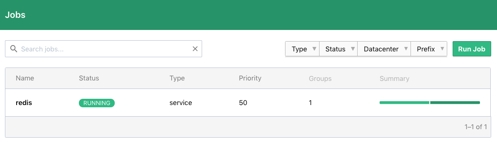
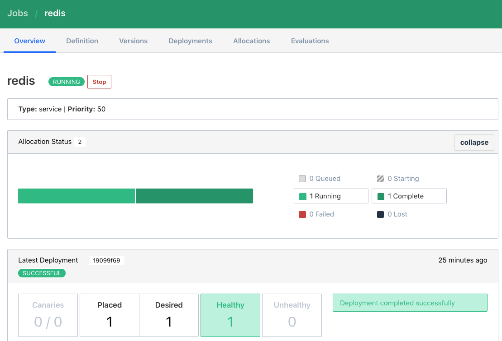
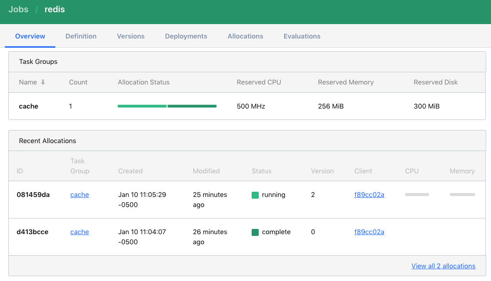
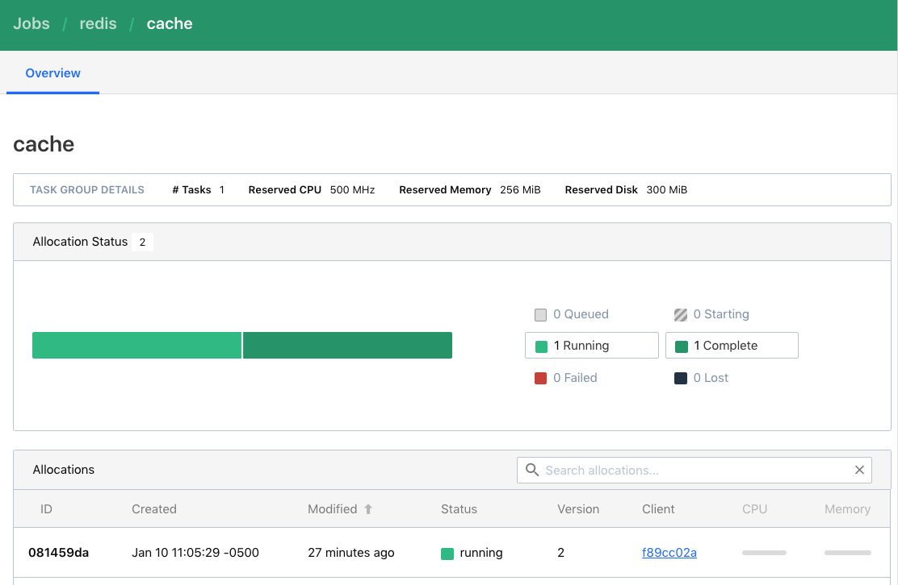
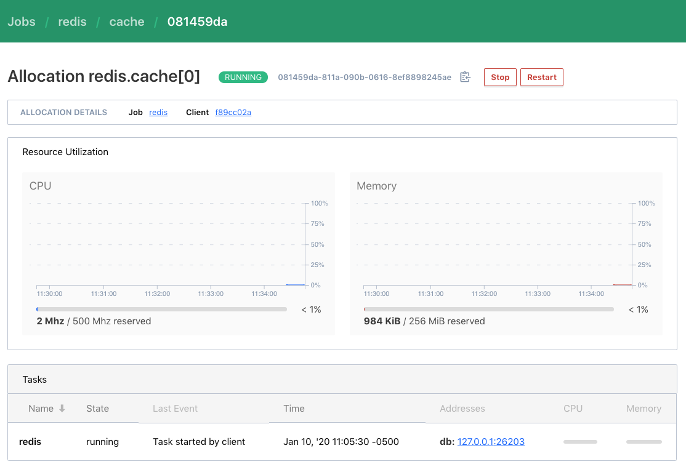
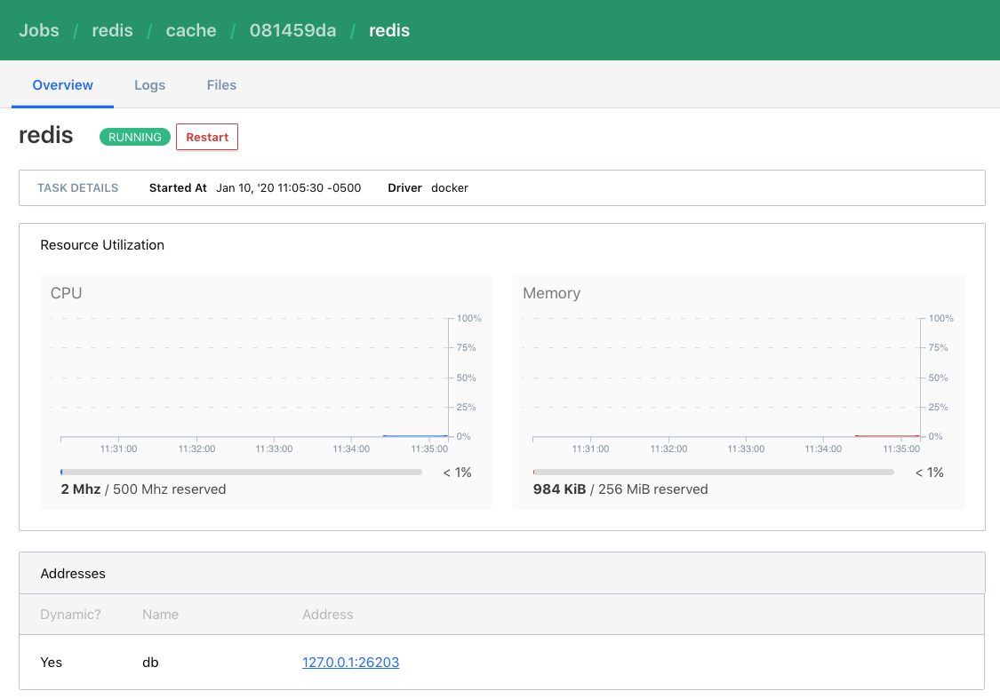
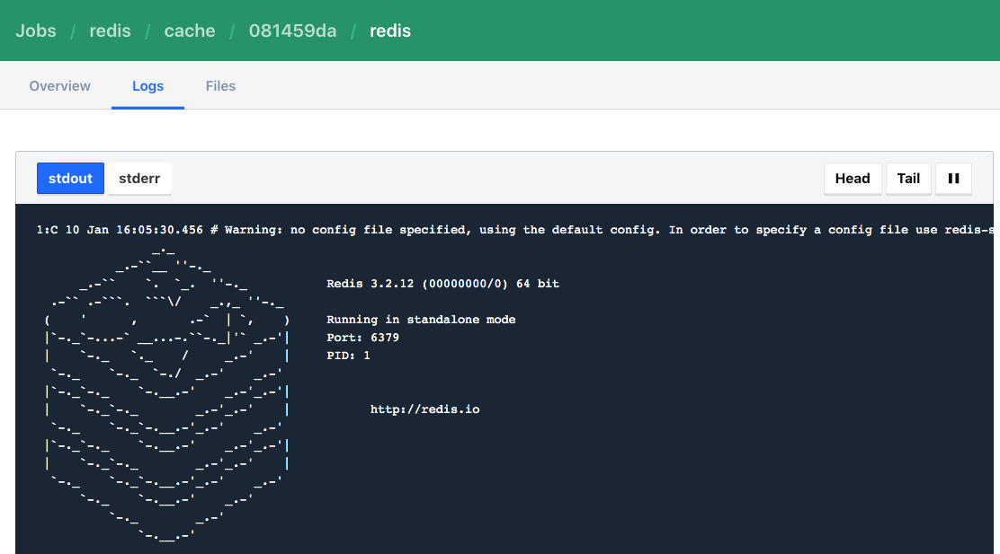

name: nomad-chapter-4-title
class: title, shelf, no-footer, fullbleed
background-image: url(https://hashicorp.github.io/field-workshops-assets/assets/bkgs/HashiCorp-Title-bkg.jpeg)
count: false

# Chapter 6
## Monitoring Nomad Jobs


???
* In this chapter, we'll discuss how to monitor Nomad jobs including their allocations, evaluations, task groups, and tasks.

---
layout: true

.footer[
- Copyright © 2020 HashiCorp
- 
]

---
name: chapter-6-topics
# Chapter 6 Topics

1. Using the Nomad CLI to Inspect Jobs
1. Using the Nomad UI to Inspect Jobs

???
* In this chapter, we'll discuss how to monitor Nomad jobs including their allocations, evaluations, task groups, and tasks.

---
name: inspect-job
class: compact, smaller
# Inspect a Job

To inspect the status of the job with the Nomad CLI, run:<br>
`nomad job status <job_id>`<br>
```output
*nomad job status redis
 ID            = redis
 Name          = redis
 Type          = service
 Status        = running
 ...
Allocations
ID        Node ID   Task Group  Version  Desired  Status   Created  Modified
*081459da  234c769f  cache       0        run      running  2m ago   2m ago
```
The output here is abbreviated but shows the ID of a running allocation, which can then be inspected.
???
* This is the command to inspect the status of a job.

---
name: inspect-allocation
class: compact, smaller
# Inspect an Allocation
To inspect an allocation with the Nomad CLI, run:<br>
`nomad alloc status <allocation_id>` <br>
```output
*nomad alloc status 081459da
*ID                  = 081459da
Eval ID             = 13ebb66d
Name                = redis.cache[0]
*Node ID             = 234c769f
*Node Name           = nomad-client-1
Job ID              = redis
```
Note that we used the *Allocation ID* from the output of the job status command and can see which node the allocation is running on.<br>
We also see the ID of the evaluation that scheduled the allocation.

???
* This is the command to inspect the status of an allocation.

---
name: inspect-allocation
class: compact, smaller
# Inspect an Evaluation
To inspect an evaluation with the Nomad CLI, run: <br>
`nomad eval status <evaluation_id>` <br>
```output
*nomad eval status 13ebb66d
ID                 = 13ebb66d
Create Time        = 1m27s ago
Status             = complete
Type               = service
Job ID             = redis
Priority           = 50
*Placement Failures = false
```
Note that we used the *Eval ID* from the output of the allocation status command.<br>
We also can verify that there were no placement failures.

???
* This is the command to inspect the status of an allocation.

---
name: show-task-logs
class: compact, smaller
# View Task Logs
To view the logs for a task with the Nomad CLI, run: <br>
`nomad alloc logs <allocation_id> <task>` <br>
```output
*nomad alloc logs 081459da redis
1:C 10 Jan 16:05:30.456 # Warning: no config file specified, using the default config. In order to specify a config file use redis-server /path/to/redis.conf
                _._
           _.-``__ ''-._
      _.-``    `.  `_.  ''-._           Redis 3.2.12 (00000000/0) 64 bit
  .-`` .-```.  ```\/    _.,_ ''-._
 (    '      ,       .-`  | `,    )     Running in standalone mode
 |`-._`-...-` __...-.``-._|'` _.-'|     Port: 6379
 |    `-._   `._    /     _.-'    |     PID: 1
```
Note that we again used the *Allocation ID* from the output of the job status command.

???
* This is the command to view logs for a task.

---
name: monitor-with-ui
# Monitoring Nomad with the Nomad UI
* The following slides show how the Nomad UI can be used to monitor:
  * Jobs
  * Allocations
  * Task Groups
  * Tasks (including their logs)

???
* The Nomad UI can also be used to monitor Nomad

---
name: nomad-ui-job-high-level
# List of Nomad Jobs
.center[]

???
* This is a screenshot showing the list of jobs in the Nomad UI.

---
name: nomad-ui-job-with-deployments
# Nomad Job with Deployments
.center[]

???
* This is a screenshot showing a job and its deployments in the Nomad UI.

---
name: nomad-ui-job-with-task-groups-and-allocations
# Nomad Job with Task Groups and Allocations
.center[]

???
* This is a screenshot showing task groups and allocations for a job in the Nomad UI.

---
name: nomad-ui-task-group
# Nomad Task Group
.center[]

???
* This is a screenshot showing a task group of a job in the Nomad UI.

---
name: nomad-ui-task-group-status-and-task
# Nomad Task Group Status and Task
.center[]

???
* This is a screenshot showing the status of a task group and its tasks in the Nomad UI.

---
name: nomad-ui-task
# Nomad Task
.center[]

???
* This is a screenshot showing the status of a task in the Nomad UI.

---
name: nomad-ui-task-logs
# Nomad Task Logs
.center[]

???
* This is a screenshot showing the logs of a task in the Nomad UI.
